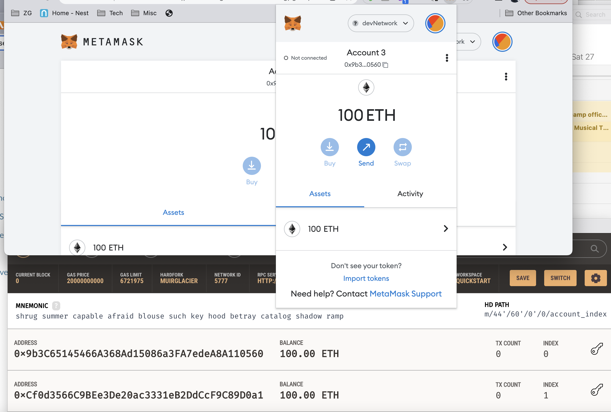
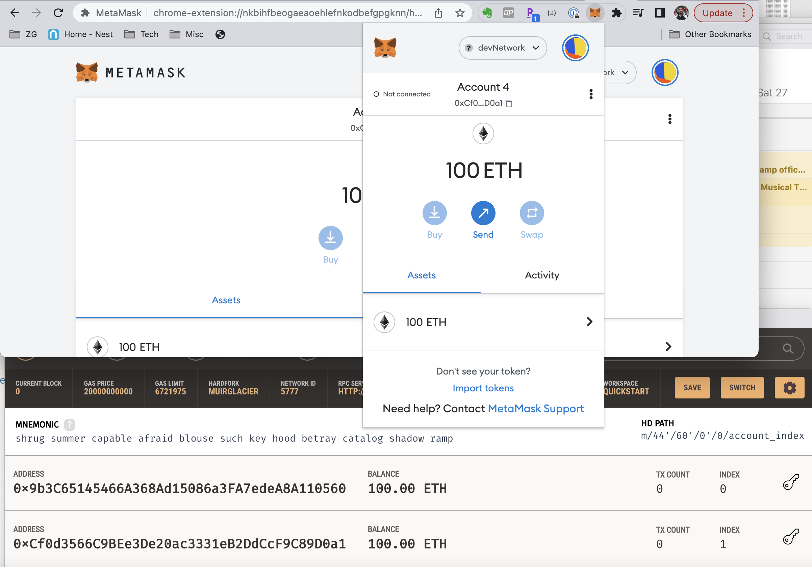
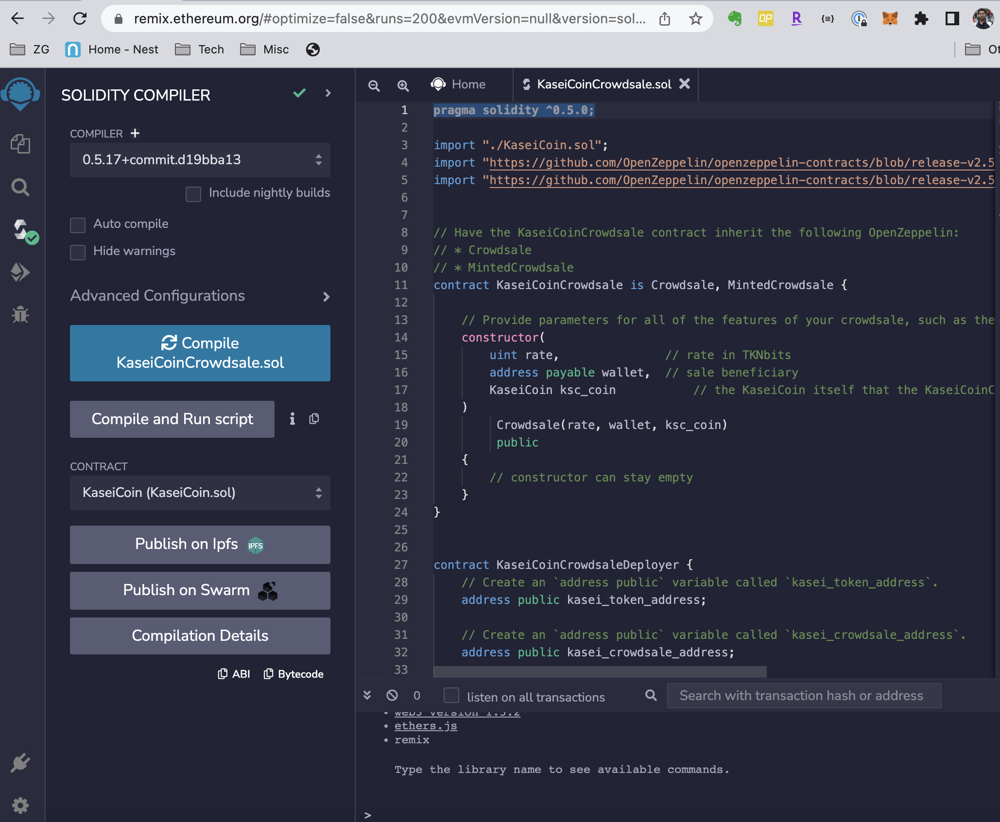
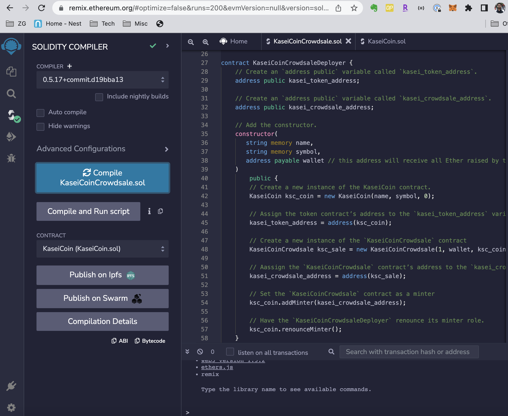
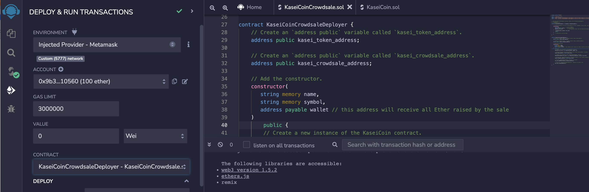

# fungible_token_crowdsale
Define new cryptocurrency KaseiCoin minted by Crowdsale

Evaluation Evidence:

Account 1 Imported:

Account 2 Imported:

Contract compiled:

Contract compiled after deployer:

Contract deployed:

